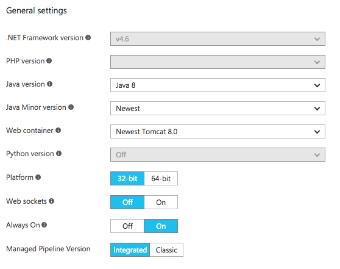
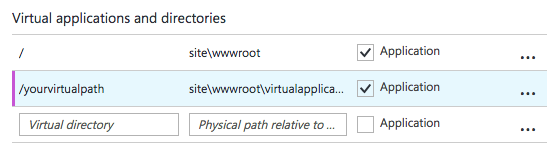

# Azure-Web-Apps-WildFly (Draft)

**Repository objective:** To enable scalable and configurable WildFly hosting on Azure Web Apps.

**Background:** Microsoft has released a [HttpPlatform](https://docs.microsoft.com/en-us/azure/app-service-web/web-sites-java-custom-upload) feature, this feature 
allows you to invoke an app and bind it to a port so that it can serve traffic. 
This is great, however this is not enough to run scalable and stable instances of WildFly inside Azure Web Apps, this repository provides the workaround. 

## Setup Instructions
### Step 1 - Create the Azure Web App
### Step 2 - Configure App Settings

