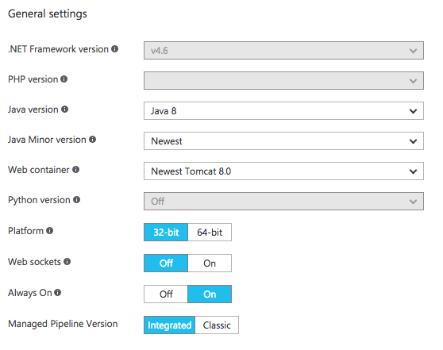
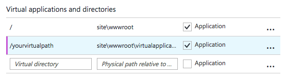
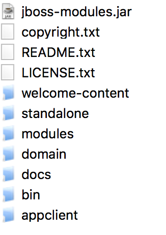

# Azure-Web-Apps-WildFly

**Repository objective:** To enable scalable and configurable WildFly hosting on Azure Web Apps.

**Background:** Microsoft has released a [HttpPlatform](https://docs.microsoft.com/en-us/azure/app-service-web/web-sites-java-custom-upload) feature, this feature 
allows you to invoke an app and bind it to a port so that it can serve traffic. 
This is great, however this is not enough to run scalable and stable instances of WildFly inside Azure Web Apps, this repository provides the **fully functional workaround**. 


## Setup Instructions
### Step 1 - Create the Azure Web App
### Step 2 - Configure App Settings
Choose the appropriate Java and Tomcat version and make sure that "Always On" is enabled.



Tomcat will be hosted at the root ("/index.jsp"), however WildFly will be hosted as a virtual application ("/yourvirtualpath/").



### Step 3 - Replace wwwroot 
Replace Azure Web Apps D:\home\site\wwwroot folder with this GitHub's Repository [wwwroot](https://github.com/zkavtaskin/Azure-Web-Apps-WildFly/tree/master/wwwroot)  folder.


### Step 4 - Download WildFly 
Download WildFly or copy the existing files in to the D:\home\site\wwwroot\virtualapplicationwildfly\WildFlyGoldCopy.

Contents of the WildFlyGoldCopy should look something like this:




### Step 5 - Customize Web.Config

Change D:\home\site\wwwroot\web.config, replace with {yourwfvirtualapppath} with your path.
Replace {YOURWEBAPP} with the URL hostname. 

```<configuration>
  <system.webServer>
    <applicationInitialization doAppInitAfterRestart="true" skipManagedModules="true">
      <add initializationPage="/" hostName="{YOURWEBAPP}.azurewebsites.net"/>
      <add initializationPage="/tomcatpath/" hostName="{YOURWEBAPP}.azurewebsites.net"/>
      <add initializationPage="/{yourwfvirtualapppath}/" hostName="{YOURWEBAPP}.azurewebsites.net"/>
      <add initializationPage="/?isreadycheck=1" hostName="{YOURWEBAPP}.azurewebsites.net"/>
      <add initializationPage="/?isreadycheck=2" hostName="{YOURWEBAPP}.azurewebsites.net"/>
      <add initializationPage="/?isreadycheck=3" hostName="{YOURWEBAPP}.azurewebsites.net"/>
    </applicationInitialization>
  </system.webServer>
</configuration>
```

Example

```
<configuration>
  <system.webServer>
    <applicationInitialization doAppInitAfterRestart="true" skipManagedModules="true">
      <add initializationPage="/" hostName="wildflyexample.azurewebsites.net"/>
      <add initializationPage="/tomcatpath/" hostName="wildflyexample.azurewebsites.net"/>
      <add initializationPage="/wildfly/" hostName="wildflyexample.azurewebsites.net"/>
      <add initializationPage="/?isreadycheck=1" hostName="wildflyexample.azurewebsites.net"/>
      <add initializationPage="/?isreadycheck=2" hostName="wildflyexample.azurewebsites.net"/>
      <add initializationPage="/?isreadycheck=3" hostName="wildflyexample.azurewebsites.net"/>
    </applicationInitialization>
  </system.webServer>
</configuration>
```

### Step 6 - Customize Index.jsp

Change D:\home\site\wwwroot\webapps\ROOT\index.jsp, replace {yourwarname} with your "your.war".

```
File file = new File(wfFolder.getPath().concat("\\standalone\\deployments\\{yourwarname}.war.deployed"));
```

Example 

```
File file = new File(wfFolder.getPath().concat("\\standalone\\deployments\\your.war.deployed"));
```


